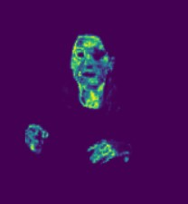
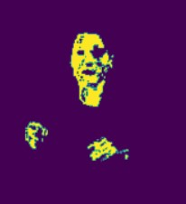
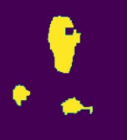
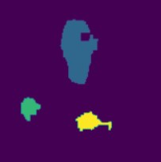
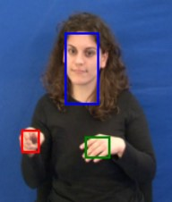
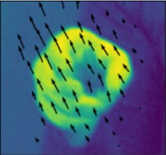
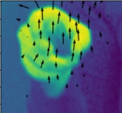
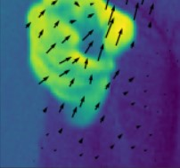
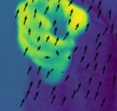

# Skin Detection

## Skin Detection Using YCbCr Color Space

To detect skin regions, we initially convert RGB images to the YCbCr color space, retaining only the Cb (chrominance blue) and Cr (chrominance red) components. This step isolates the true color information of the skin while discarding the Y (luminance) component, which varies depending on lighting conditions. This transformation reduces the influence of lighting and emphasizes chromatic consistency in skin tones.

  

Next, using the training image, we compute the mean values of the Cb and Cr components and their covariance matrix. For each pixel in the video frames, we calculate its likelihood value using the Gaussian distribution parameterized by the computed statistics. This probabilistic approach effectively identifies skin-like regions in the images, as the Gaussian model captures the variability of skin tones.

  

To refine the detection, we apply a thresholding operation. Pixels with a likelihood value greater than 0.23 are retained, producing binary masks highlighting the detected skin regions.

Following thresholding, morphological operations are applied to clean and structure the binary masks:

Opening (using a 4x4 pixel kernel): Removes small noise and disconnects unrelated small regions.
Closing (using a 10x10 pixel kernel): Bridges small gaps and fills holes within detected skin regions.

  

Through experimentation, it was observed that kernel sizes significantly affect the separation of face and hands, especially when the hands are close to the face (e.g., for sign language interpreters). The chosen sizes provided optimal segmentation for most scenarios.

Using Python functions like label and np.unique, we identify connected components in the binary masks. From these, the three largest connected components (typically representing the face and both hands) are retained.

  

Finally, bounding boxes are calculated by enclosing the identified components within rectangles, allowing us to capture the positions of the face and hands effectively.

  

---

# Optical Flow Calculation

## Lucas-Kanade Algorithm

The Lucas-Kanade algorithm is a widely used method for optical flow computation based on the **least-squares principle**. Its goal is to estimate the motion vector \( \mathbf{u} = (u, v) \) at each pixel of an image sequence by solving for the best-fit motion consistent with the intensity changes.

## **Theoretical Basis**

The algorithm operates under the **optical flow constraint equation**:

\[
I_x u + I_y v + I_t = 0
\]

Where:
- \( I_x, I_y \) are the spatial intensity gradients in the \( x \)- and \( y \)-directions.
- \( I_t \) is the temporal intensity gradient.
- \( u, v \) represent the horizontal and vertical components of the flow vector \( \mathbf{u} \).

### **Assumptions**
1. The intensity of a moving object remains constant over time: \( I(x, y, t) = I(x + u, y + v, t+1) \).
2. Small motion approximation: Higher-order terms in the Taylor expansion of the intensity function are ignored.
3. Local spatial coherence: Neighboring pixels have similar motion.

### **Least-Squares Formulation**
To estimate \( \mathbf{u} \) for each pixel, Lucas-Kanade uses a local window \( W \) (e.g., \( 5 \times 5 \)) and minimizes the squared error of the constraint equation for all pixels in \( W \):

\[
E(u, v) = \sum_{(x_i, y_i) \in W} \left( I_x(x_i, y_i) u + I_y(x_i, y_i) v + I_t(x_i, y_i) \right)^2
\]

This leads to solving the following linear system:

\[
\begin{bmatrix}
\sum I_x^2 & \sum I_x I_y \\
\sum I_x I_y & \sum I_y^2
\end{bmatrix}
\begin{bmatrix}
u \\
v
\end{bmatrix}
=
\begin{bmatrix}
-\sum I_x I_t \\
-\sum I_y I_t
\end{bmatrix}
\]

Or in matrix form:

\[
A \cdot \mathbf{u} = \mathbf{b}
\]

Where:
- \( A \) is the \( 2 \times 2 \) structure tensor:

\[
A =
\begin{bmatrix}
\sum I_x^2 & \sum I_x I_y \\
\sum I_x I_y & \sum I_y^2
\end{bmatrix}
\]

- \( \mathbf{b} = \begin{bmatrix} -\sum I_x I_t \\ -\sum I_y I_t \end{bmatrix} \)

The solution for \( \mathbf{u} \) is given by:

\[
\mathbf{u} = A^{-1} \mathbf{b}
\]

### **Implementation Details**
1. **Gradient Calculation**:
   - The partial derivatives \( I_x, I_y, I_t \) are computed using numerical methods. In Python, we used `np.gradient` to obtain \( I_x \) and \( I_y \), and temporal differences for \( I_t \).

2. **Isotropic Gaussian Filtering**:	
   - To improve robustness against noise, a Gaussian filter (scale \( \rho \)) is applied to the elements of \( A \) and \( \mathbf{b} \). This was implemented using a Gaussian kernel.

3. **Iterative Updates**:
   - For each pixel, the flow vector \( \mathbf{d} \) is updated iteratively:

   \[
   \mathbf{d}_{i+1} = \mathbf{d}_i + \mathbf{u}
   \]
   - The stopping criterion is based on the **L2 norm** of \( \mathbf{u} \): If \( \| \mathbf{u} \|_2 < 0.02 \),the iterations stop. Otherwise, the algorithm continues for a maximum of 300 iterations.
### **Observations**
- With parameters \( \epsilon = 0.005 \) and \( \rho = 2 \), results were stable. However, for very small \( \epsilon \) (e.g., \( 0.001 \)), the algorithm produced erroneous flow with unnatural patterns in some cases.
- The algorithm struggled to converge within the maximum iterations for high-motion areas, like hands in images.

---

## **Optical Flow Displacement for Bounding Boxes**

To compute the displacement vector for a region of interest (ROI) such as a bounding box, we implemented the function:

displ(d_x, d_y, threshold)

This function processes optical flow vectors \(\mathbf{d}_x, \mathbf{d}_y \) within the ROI using the following steps:
1. **Energy-Based Filtering**:
   - Compute the maximum flow energy \( E_{max} \) as:

   \[
   E = \sqrt{d_x^2 + d_y^2}, \quad E_{max} = \max(E)
   \]

   - Retain vectors satisfying \( E \geq \text{threshold} \cdot E_{max} \).

2. **Averaging**:
   - Compute the mean of the retained vectors to represent the displacement for the entire bounding box.

For \( \text{threshold} = 0.5 \) (50%), the results were satisfactory.

  
  
  

### **Multiscale Lucas-Kanade**

To address limitations in large-motion scenarios (e.g., motion > 1-2 pixels), we extended the algorithm to work on multiple scales. The implementation involved the function:

multi_lk(I1, I2, features, rho, epsilon, dx_0, dy_0, Num)

### Procedure

#### Gaussian Pyramids:
- Downsample the images \( I_1 \) and \( I_2 \) \( Num \) times, each time filtering with a Gaussian kernel (3 pixels wide) to reduce spectral aliasing.

#### Iterative LK at Each Scale:
- Start with the smallest scale (coarsest resolution) and apply Lucas-Kanade using \( d_x, d_y \) as the initial conditions.
- At each finer scale, the computed displacement is doubled and used as the initial condition for the next level.

### Advantages
- **Improved Convergence**: The multiscale approach allows better handling of large motions by focusing on coarse details first.
- **Faster Execution**: Since each scale starts with optimized initial conditions, convergence is faster compared to single-scale LK.
- **Higher Accuracy**: The algorithm is more resilient to distortions in flow caused by large displacements.

### Results
The multiscale Lucas-Kanade significantly outperformed the single-scale version, especially in high-motion areas like hands, where single-scale LK failed.

  
  
  

---

# Harris and Gabor Feature Detectors

## Harris Corner Detector

The Harris detector computes local derivatives using Gaussian kernels and directional filters. The corner criterion is derived from the determinant and trace of the structure tensor.

## Gabor Feature Detector

Gabor filters are applied spatially and temporally to enhance specific orientations and motions. The sum of squared filter responses is used as the significance criterion.

---

# Feature Descriptors

## HOG and HOF Descriptors

The HOG descriptor computes a histogram of spatial gradients, while the HOF descriptor uses dense optical flow fields (e.g., TVL1). Both descriptors analyze local regions around key points to capture motion and texture information.

## SVM Classification

Using these descriptors, an SVM classifier was trained and tested on labeled video datasets. Results showed that the Gabor detector combined with HOF achieved 100% accuracy, outperforming other combinations.

---

# Feature Matching with SIFT

## Steps for SIFT Feature Matching

1. Detect key points and compute descriptors using `sift.detectAndCompute`.
2. Match features between images using `cv.FlannBasedMatcher`.
3. Filter matches based on distance ratio (e.g., <0.75).
4. Refine matches with the RANSAC algorithm to estimate homography.
5. Transform images using the calculated homography and align them.

---

# Final Notes

With the placeholders above, you can insert your images directly into the Markdown. Let me know if you need help with further edits!
