# Skin Detection

## Skin Detection Using YCbCr Color Space

To detect skin regions, we initially convert RGB images to the YCbCr color space, retaining only the Cb (chrominance blue) and Cr (chrominance red) components. This step isolates the true color information of the skin while discarding the Y (luminance) component, which varies depending on lighting conditions. This transformation reduces the influence of lighting and emphasizes chromatic consistency in skin tones.

  

Next, using the training image, we compute the mean values of the Cb and Cr components and their covariance matrix. For each pixel in the video frames, we calculate its likelihood value using the Gaussian distribution parameterized by the computed statistics. This probabilistic approach effectively identifies skin-like regions in the images, as the Gaussian model captures the variability of skin tones.

  

To refine the detection, we apply a thresholding operation. Pixels with a likelihood value greater than 0.23 are retained, producing binary masks highlighting the detected skin regions.

Following thresholding, morphological operations are applied to clean and structure the binary masks:

Opening (using a 4x4 pixel kernel): Removes small noise and disconnects unrelated small regions.
Closing (using a 10x10 pixel kernel): Bridges small gaps and fills holes within detected skin regions.

  

Through experimentation, it was observed that kernel sizes significantly affect the separation of face and hands, especially when the hands are close to the face (e.g., for sign language interpreters). The chosen sizes provided optimal segmentation for most scenarios.

Using Python functions like label and np.unique, we identify connected components in the binary masks. From these, the three largest connected components (typically representing the face and both hands) are retained.

  

Finally, bounding boxes are calculated by enclosing the identified components within rectangles, allowing us to capture the positions of the face and hands effectively.

  

---

# Optical Flow Calculation

## Lucas-Kanade Algorithm

The Lucas-Kanade algorithm is a widely used method for optical flow computation based on the **least-squares principle**. Its goal is to estimate the motion vector $$\( \mathbf{u} = (u, v) \)$$ at each pixel of an image sequence by solving for the best-fit motion consistent with the intensity changes.

## **Theoretical Basis**

The algorithm operates under the **optical flow constraint equation**:

$$
I_x u + I_y v + I_t = 0
$$

Where:
- $$\( I_x, I_y \)$$ are the spatial intensity gradients in the $$\( x \)$$- and $$\( y \)$$-directions.
- $$\( I_t \)$$ is the temporal intensity gradient.
- $$\( u, v \)$$ represent the horizontal and vertical components of the flow vector $$\( \mathbf{u} \)$$.

### **Assumptions**
1. The intensity of a moving object remains constant over time: $$I(x, y, t) = I(x + u, y + v, t+1)$$.
2. Small motion approximation: Higher-order terms in the Taylor expansion of the intensity function are ignored.
3. Local spatial coherence: Neighboring pixels have similar motion.

### **Least-Squares Formulation**
To estimate $$\( \mathbf{u} \)$$ for each pixel, Lucas-Kanade uses a local window $$\( W \)$$ (e.g., $$\( 5 \times 5 \)$$) and minimizes the squared error of the constraint equation for all pixels in \( W \):

$$
E(u, v) = \sum_{(x_i, y_i) \in W} \left( I_x(x_i, y_i) u + I_y(x_i, y_i) v + I_t(x_i, y_i) \right)^2
$$

This leads to solving the following linear system

$$
\begin{bmatrix}
\sum I_x^2 & \sum I_x I_y \\
\sum I_x I_y & \sum I_y^2
\end{bmatrix}
\begin{bmatrix}
u \\
v
\end{bmatrix} = 
\begin{bmatrix}
-\sum I_x I_t \\
-\sum I_y I_t
\end{bmatrix}
$$

Or in matrix form:

$$
A \cdot \mathbf{u} = \mathbf{b}
$$

Where:
- $$\( A \)$$ is the $$\( 2 \times 2 \)$$ structure tensor

$$
A =
\begin{bmatrix}
\sum I_x^2 & \sum I_x I_y \\
\sum I_x I_y & \sum I_y^2
\end{bmatrix}
$$

$$\( \mathbf{b} = \begin{bmatrix} -\sum I_x I_t \\ -\sum I_y I_t \end{bmatrix} \)$$

The solution for $$\( \mathbf{u} \)$$ is given by:

$$
\mathbf{u} = A^{-1} \mathbf{b}
$$

### **Implementation Details**
1. **Gradient Calculation**:
   - The partial derivatives $$\( I_x, I_y, I_t \)$$ are computed using numerical methods. In Python, we used `np.gradient` to obtain $$\( I_x \) and \( I_y \)$$, and temporal differences for $$\( I_t \)$$.

2. **Isotropic Gaussian Filtering**:	
   - To improve robustness against noise, a Gaussian filter (scale $$\( \rho \)$$) is applied to the elements of $$\( A \)$$ and $$\( \mathbf{b} \)$$. This was implemented using a Gaussian kernel.

3. **Iterative Updates**:
   - For each pixel, the flow vector $$\( \mathbf{d} \)$$ is updated iteratively: $$\mathbf{d_{i+1}} = \mathbf{d_i} + \mathbf{u}$$

   - The stopping criterion is based on the **L2 norm** of $$\( \mathbf{u} \)$$: If $$\( \| \mathbf{u} \|2 < 0.02 \)$$, the iterations stop. Otherwise, the algorithm continues for a maximum of 300 iterations.

### **Observations**
- With parameters $$\( \epsilon = 0.005 \)$$ and $$\( \rho = 2 \)$$, results were stable. However, for very small $$\( \epsilon \) (e.g., \( 0.001 \)$$), the algorithm produced erroneous flow with unnatural patterns in some cases.
- The algorithm struggled to converge within the maximum iterations for high-motion areas, like hands in images.

---

## **Optical Flow Displacement for Bounding Boxes**

To compute the displacement vector for a region of interest (ROI) such as a bounding box, we implemented the function:

`displ(d_x, d_y, threshold)`

This function processes optical flow vectors $$(\mathbf{d_x}, \mathbf{d_y} \)$$ within the ROI using the following steps:

1. **Energy-Based Filtering**:
   - Compute the maximum flow energy \( E_{max} \) as:

   $$E = \sqrt{d_x^2 + d_y^2}, \quad E_{max} = \max(E)$$

   - Retain vectors satisfying $$\( E \geq \text{threshold} \cdot E_{max} \)$$.

2. **Averaging**:
   - Compute the mean of the retained vectors to represent the displacement for the entire bounding box.

For $$\( \text{threshold} = 0.5 \)$$ (50%), the results were satisfactory.

  
  
  

### **Multiscale Lucas-Kanade**

To address limitations in large-motion scenarios (e.g., motion > 1-2 pixels), we extended the algorithm to work on multiple scales. The implementation involved the function:

`multi_lk(I1, I2, features, rho, epsilon, dx_0, dy_0, Num)`

### Procedure

#### Gaussian Pyramids:
- Downsample the images \( I_1 \) and \( I_2 \) \( Num \) times, each time filtering with a Gaussian kernel (3 pixels wide) to reduce spectral aliasing.

#### Iterative LK at Each Scale:
- Start with the smallest scale (coarsest resolution) and apply Lucas-Kanade using \( d_x, d_y \) as the initial conditions.
- At each finer scale, the computed displacement is doubled and used as the initial condition for the next level.

### Advantages
- **Improved Convergence**: The multiscale approach allows better handling of large motions by focusing on coarse details first.
- **Faster Execution**: Since each scale starts with optimized initial conditions, convergence is faster compared to single-scale LK.
- **Higher Accuracy**: The algorithm is more resilient to distortions in flow caused by large displacements.

### Results
The multiscale Lucas-Kanade significantly outperformed the single-scale version, especially in high-motion areas like hands, where single-scale LK failed.

  
  
  

---

# Harris and Gabor Feature Detectors

### Initial Computation of L Matrices

To begin, we compute the $$\( L \)$$ matrices by performing one-dimensional convolution along the first two spatial dimensions of the video frames with a Gaussian kernel of standard deviation $$\( \sigma \)$$. For the temporal dimension, we convolve with a Gaussian kernel of standard deviation $$\( \tau \)$$. 

Next, we apply one-dimensional convolution along each axis using the kernel:

$$\[
\begin{bmatrix}
-1 & 0 & 1
\end{bmatrix}
\]$$

to compute the partial derivatives. Following this, we calculate the elements of the matrix $$\( A \)$$ and repeat the process with scaled Gaussian densities $$\( s\sigma \)$$ and $$\( s\tau \)$$. 

Using the functions `numpy.linalg.det` and `numpy.linalg.trace`, we compute the **cornerness criterion** for each region.

---

### **Gabor Detector**
#### 2.1.2) Implementation Details
We implement two filters, **hev** and **hod**, and apply convolution with a two-dimensional Gaussian kernel along the spatial components. Additionally, convolution with the filters is performed along the temporal component. By adding the squared results, we obtain the **saliency criterion** for the Gabor detector.

After calculating the criteria for both Harris and Gabor detectors, we identify the top 600 key points that maximize these criteria. We append a vertical column to both matrices containing the scale values at which the computations were performed (useful for the `show_detection` function).

#### Visualization Example
Below is a visualization of the Harris (left) and Gabor (right) criteria for the same frame:

  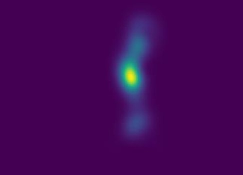
  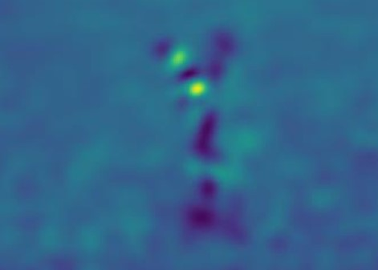

**Observations**:
- Even for the same frame, the detectors exhibit different responses. Harris emphasizes regions like the elbow, while Gabor highlights areas around the hands.
- Harris produces significantly lower values in non-body regions, effectively rejecting irrelevant areas.

---

#### Comparative Frames
**Example 1**: Boxing Frames  

  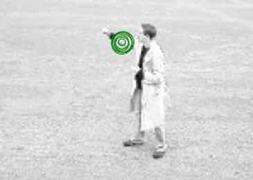
  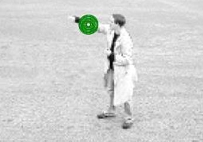

Frames 26 and 27 from the video *person12_boxing_d3_uncomp.avi* show that:
- The Gabor detector successfully identifies hand movements in the first row.
- Harris, shown in the second row, fails to detect the motion.

**Example 2**: Running Frames  

  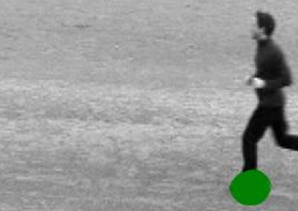
  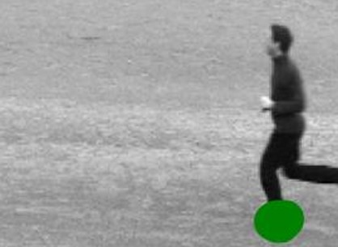

Frames from the video *person01_running_d1_uncomp.avi* demonstrate:
- Harris detects the runner's legs in the first row.
- Gabor highlights areas near the knees in the second row.

These differences stem from the distinct criteria maximized by each detector, which leads to varying regions of interest.

---

### Descriptors Implementation

We implemented the `Descriptors` function, which returns **HOG (Histogram of Oriented Gradients)** and **HOF (Histogram of Optical Flow)** descriptors:

- **HOG Descriptor**:
  - Computes histograms of the two spatial derivatives around the points of interest ($$\( \pm 4\sigma \)$$ in each direction).

- **HOF Descriptor**:
  - Computes histograms based on the dense optical flow field using the **TVL1** method.

---

### SVM Training and Results

After computing the directional histograms, we trained an SVM classifier for each combination of detectors and descriptors. Using the provided text file, we split the videos into training and testing sets, yielding the following results:

| **Accuracy Metrics** | **HOG** | **HOF** | **HOG/HOF** |
|-----------------------|---------|---------|-------------|
| **Gabor**            | 0.834   | 1.0     | **1.0**     |
| **Harris**           | 0.5834  | 1.0     | 0.667       |

#### Observations
- The Gabor detector generally outperformed the Harris detector.
- The combination of **HOF-Gabor** and **HOG/HOF-Gabor** achieved the highest accuracy (100%).

---

This methodology highlights the strengths and weaknesses of different detectors and descriptors in various motion scenarios. The choice of detector-descriptor pairing has a significant impact on performance, as demonstrated in the results.

---

# Keypoint Detection, Matching, and Image Stitching

## Step 1: Keypoint Detection and Descriptor Computation
Using the function `sift.detectAndCompute`, we calculate keypoints in each image and compute local descriptors for these points. The identified keypoints on the original images are as follows:

  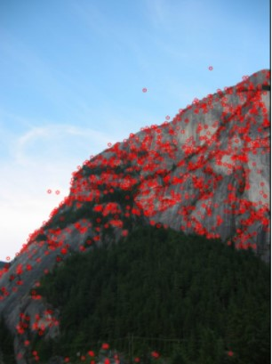
  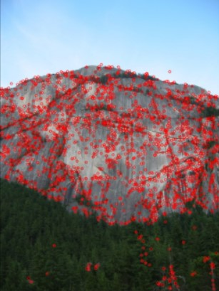
  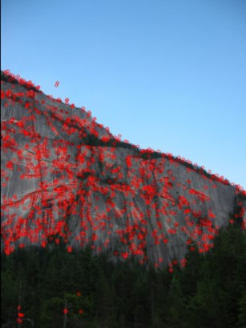

  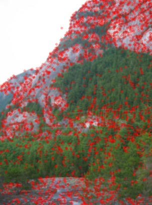
  
  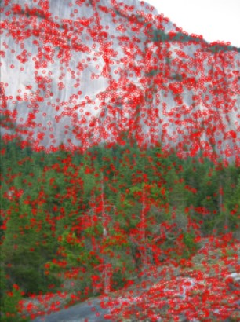

## Step 2: Keypoint Matching
To match the detected keypoints, we opted for the `cv.FlannBasedMatcher` function. This method offers good results while being significantly faster than exhaustive methods such as `BFMatcher`. For each keypoint in one image, we compute the two closest matches using `knnMatch` based on their descriptors. This matching process between two images results in:

  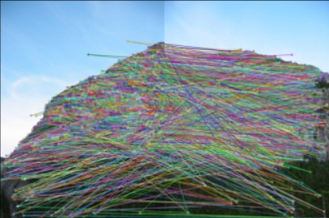

Although several matches are identified, many are inaccurate. Therefore, in the next step, we retain only the "best" matches based on the ratio being lower than 0.75.

## Step 3: Filtering Matches
For each matched keypoint, we calculate two distances: one for the best match and another for the second-best match. We retain only those keypoints where the ratio of these distances is less than 0.75. After applying this filter:

  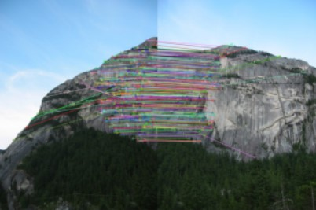

We observe that primarily the keypoints present in both images remain, indicating successful matching.

## Step 4: Homography Estimation and Outlier Removal
Despite the filtered matches, some outliers persist. To address this, we employ the RANSAC algorithm to compute the homography matrix $$\( H \)$$ robustly, unaffected by outliers. The homography matrix is calculated using the `cv.findHomography` function, with the RANSAC threshold set to 5 (a value between 1 and 10 is typically optimal). This results in:

## Step 5: Image Warping
To compute the transformed image, the following steps were performed:

1. **Perspective Transformation:** Using `cv.perspectiveTransform`, we calculate the new positions of the corners of the transformed image $$\( img1_{warped} \)$$.
2. **Dimension Calculation:** Based on these positions (in the coordinate system of $$\( img2 \)$$), we determine the overall dimensions of $$\( img1\_warped \)$$ (including black regions) and the coordinates of the top-left corner.
3. **Inverse Warping:** All points of $$\( img1_{warped} \)$$ are mapped to the coordinate system of $$\( img1 \)$$ by adjusting their offset and passing them through the inverse of the homography matrix $$\( H^{-1} \)$$ using `cv.perspectiveTransform`.
4. **Pixel Mapping:** For each mapped point in $$\( img1 \)$$, only those within its bounds are retained, as black regions in $$\( img1_{warped} \)$$ do not correspond to valid pixels.
5. **Floating Point Conversion:** Pixel coordinates, initially floating-point values, are converted to integers using `np.floor` for correspondence with pixel indices. Linear interpolation methods (e.g., `scipy.interpolate.griddata`) were tested but found significantly slower than the simpler rounding methods.
6. **Pixel Transfer:** RGB values from \( img1 \) are transferred to their corresponding locations in $$\( img1_{warped} \)$$.

For example, applying this transformation to `1.png` (left section of the mountain) with the homography matrix $$\( H \)$$ from `2.png` (central section of the mountain) yields:

The image is correctly shifted to align for stitching in the next step.

  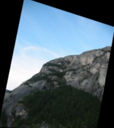

## Step 6: Image Stitching
To merge $$\( img1_{warped} \)$$ and $$\( img2 \)$$, the `mergeWarpedImages` function was implemented. This function takes as input the dimensions and top-left corner coordinates of $$\( img1_{warped} \)$$ (relative to the coordinate system of $$\( img2 \)$$). The process involves:

1. **Final Image Dimensions:** Based on the dimensions of $$\( img1\_warped \)$$ and $$\( img2 \)$$, the dimensions of the final image $$\( stitchedImage \)$$ are computed.
2. **Image Copying:** Both images are copied into $$\( stitchedImage \)$$ sequentially, starting with $$\( img1\_warped \)$$ and followed by $$\( img2 \)$$, ensuring no overlap with black regions.
3. **Black Region Removal:** Any padded black regions around the final image are removed for aesthetic purposes, without affecting the final output.

Finally, applying the `stitchImages` function recursively across all six mountain images produces the following results at each step:

  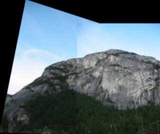
  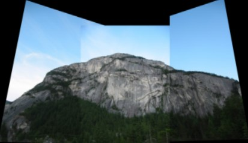
  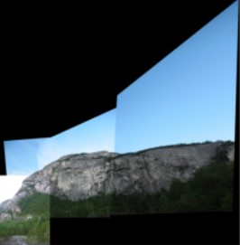
  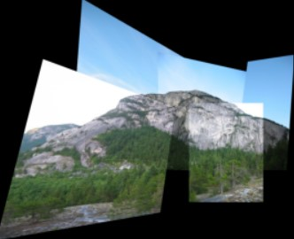
  

The final stitched image seamlessly combines all sections of the mountain into one cohesive image.
