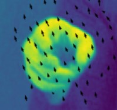
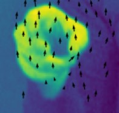

# Skin Detection

## Skin Detection Using YCbCr Color Space

To detect skin regions, RGB images are converted into the YCbCr color space, retaining only the Cb and Cr components. This approach isolates the actual skin color, removing the Y component, which represents brightness and is influenced by lighting conditions.

  
  

After calculating the mean and covariance matrix of the Cb and Cr components from a training image, the value of each pixel in the video is evaluated against a Gaussian distribution.

Subsequently, the pixel distribution is thresholded, keeping only those with values greater than 0.23. Morphological operations, **Opening** with a kernel size of 4x4 pixels and **Closing** with a kernel size of 10x10 pixels, are applied. These operations refine the detected regions, especially in distinguishing facial areas from hands.

Using Python commands `label` and `np.unique`, connected components in the image are identified. The three largest connected components (face and two hands) are retained, and bounding boxes enclosing them are drawn.

---

# Optical Flow Calculation

## Lucas-Kanade Algorithm

The Lucas-Kanade algorithm is widely used for optical flow estimation. It applies the least-squares method and computes the displacement vector \( u \) at each image pixel.

Initially, the image's partial derivatives are calculated using `np.gradient`. Displaced images are then computed via `map_coordinates`, and a Gaussian filter (of scale \( \rho \)) is applied to smooth elements of the matrices.

### Bounding Box Displacement Calculation

To compute the displacement vectors for a bounding box, the function `displ(d_x, d_y, threshold)` is implemented. It filters optical flow vectors based on a threshold of their energy \( E_{max} \).

### Handling Large Movements

The single-scale Lucas-Kanade algorithm struggles with large displacements (e.g., >1–2 pixels). To address this, a multi-scale implementation was developed. The input images are downscaled multiple times, forming a Gaussian pyramid.

The multi-scale method consistently outperformed the single-scale version, especially in hand-tracking scenarios.

---

# Harris and Gabor Feature Detectors

## Harris Corner Detector

The Harris detector computes local derivatives using Gaussian kernels and directional filters. The corner criterion is derived from the determinant and trace of the structure tensor.

## Gabor Feature Detector

Gabor filters are applied spatially and temporally to enhance specific orientations and motions. The sum of squared filter responses is used as the significance criterion.

---

# Feature Descriptors

## HOG and HOF Descriptors

The HOG descriptor computes a histogram of spatial gradients, while the HOF descriptor uses dense optical flow fields (e.g., TVL1). Both descriptors analyze local regions around key points to capture motion and texture information.

## SVM Classification

Using these descriptors, an SVM classifier was trained and tested on labeled video datasets. Results showed that the Gabor detector combined with HOF achieved 100% accuracy, outperforming other combinations.

---

# Feature Matching with SIFT

## Steps for SIFT Feature Matching

1. Detect key points and compute descriptors using `sift.detectAndCompute`.
2. Match features between images using `cv.FlannBasedMatcher`.
3. Filter matches based on distance ratio (e.g., <0.75).
4. Refine matches with the RANSAC algorithm to estimate homography.
5. Transform images using the calculated homography and align them.

---

# Final Notes

With the placeholders above, you can insert your images directly into the Markdown. Let me know if you need help with further edits!
