#### Section 1.1: Initial Image and Noise Addition
1. **Initial Image**:
   - **Grayscale Image**: Presented in its original form, showcasing the reference image before any modifications.
   

     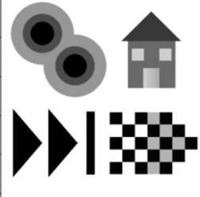
   

2. **Noise Addition**:
   - Images for $$\(PSNR = 20dB\)$$ and $$\(PSNR = 10dB\)$$ demonstrate the impact of varying levels of noise.
   

      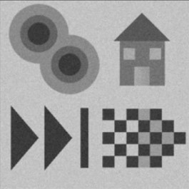
      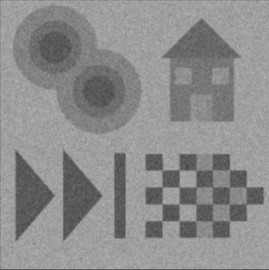
   

   - **Observation**: Noise is significantly more apparent in the $$\(10dB\)$$ image, disrupting the clarity of details.

---

#### Section 1.2: Kernel Design and Edge Detection Approaches
1. **Gaussian and Laplacian of Gaussian (LoG) Kernels**:
   - Designed using OpenCV's `getGaussianKernel` and a custom `meshgrid` LoG formula.
   - Kernels exhibit:
   
    
      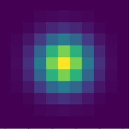
      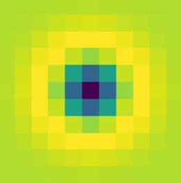
   

   - **Gaussian**: A central peak, resembling a smooth distribution.
   - **LoG**: A central minimum with a surrounding positive region (inverted "Mexican hat").

2. **Smoothing with Gaussian Kernel**:
    - Images are smoothed to reduce noise, displayed for both $$\(PSNR = 20dB\)$$ and $$\(10dB\)$$.
   
     
      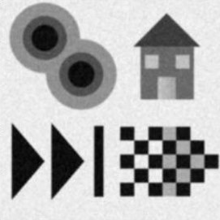
      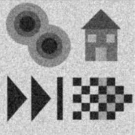
   

3. **Edge Detection Methods**:
   - **Linear Approach**:
     - Applies the LoG filter directly to the original image. Since smoothing is integrated into the filter, no prior smoothing is needed.
   

      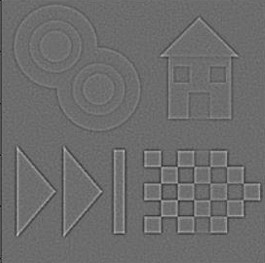
      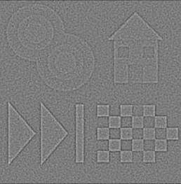
   

   - **Non-Linear Approach**:
     - Utilizes erosion and dilation operations on the smoothed image.
     - Difference from linear method: Non-linear filters are more robust to noise.
   

      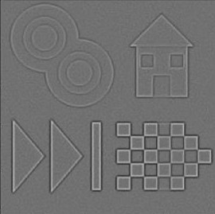
      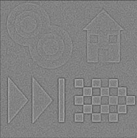
   

   - **Result Comparison**:
     - Non-linear methods display cleaner edges, especially at \(PSNR = 10dB\), as noise has less impact on edge clarity.
     

      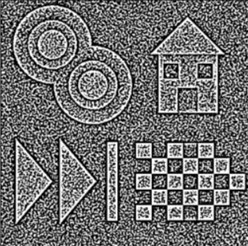
      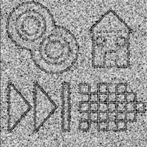
      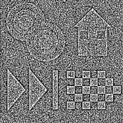
      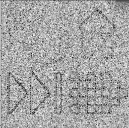
     

     

      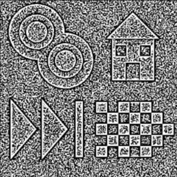
      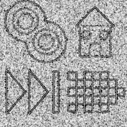
      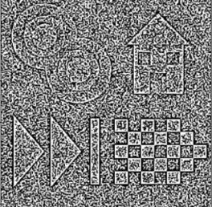
      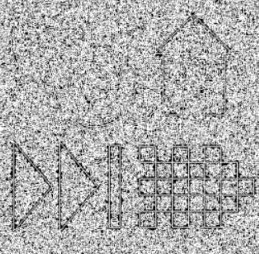
     

---

#### Section 1.3: Binary Edge Maps and Thresholding
1. **Binary Edge Sign Maps** ($$\(X\)$$):
   - These maps indicate the sign of the second derivative, helping to locate edges.
   - Thresholding ($$\(\theta_{edge}\)$$) is applied to minimize noise effects.
   - Results show trade-offs between edge retention and noise suppression:
     - Higher $$\(\theta_{edge}\)$$ removes noise but risks losing fine edges.
     

      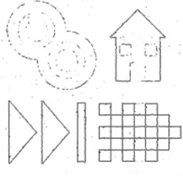
      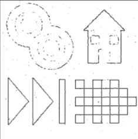
     

     
     - Lower $$\(\theta_{edge}\)$$ retains noise but maintains more detailed edges.
     

      
      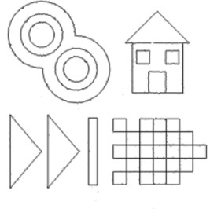
     

2. **PSNR Observations**:
   - **20dB**: Both linear and non-linear methods yield similar results due to low noise levels.
   - **10dB**: Non-linear approaches consistently outperform linear ones in noise resilience.

---

#### Section 1.4: Evaluation and Metrics
1. **True Edges and Evaluation**:
   - Ground truth edges ($$\(\theta_{realedge}\)$$) help measure the accuracy of detected edges.
   - Precision, recall, and their average provide quantitative metrics for performance.

   | Parameters                                    | C-evaluation |
   |-----------------------------------------------|--------------|
   | PSNR=20dB, σ=1.3, θ=0.35, linear approach     | 0.853121     |
   | PSNR=20dB, σ=1.3, θ=0.35, non-linear approach | 0.854772     |
   | PSNR=15dB, σ=1.6, θ=0.4, linear approach      | 0.837746     |
   | PSNR=15dB, σ=1.6, θ=0.4, non-linear approach  | 0.846461     |
   | PSNR=10dB, σ=1.7, θ=0.45, linear approach     | 0.774321     |
   | PSNR=10dB, σ=1.7, θ=0.45, non-linear approach | 0.807682     |

2. **Analysis**:
   - As noise increases, non-linear methods maintain better scores.
   - Differences between linear and non-linear methods become more pronounced with higher noise levels.

---

#### Section 1.5: Advanced Example with Fine Details
1. **Building Edge Detection**:
   - For an image like "duomo_edges.jpg," containing fine, closely packed edges, parameter tuning is crucial:
     - Small $$\(\sigma\)$$ and $$\(\theta_{edge}\)$$ values retain as much detail as possible.
     - Larger $$\(\sigma\)$$ and $$\(\theta_{edge}\)$$ values smooth out smaller details, leaving only prominent edges.
     

      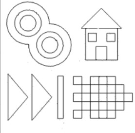
      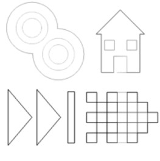
     

2. **Comparison**:
   - Non-linear methods capture more edges on the building's facade and side, while linear methods miss finer details.
   - Trade-offs arise as higher $$\(\sigma\)$$ or $$\(\theta_{edge}\)$$ values excessively smooth or suppress details.
   

      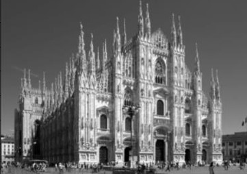
      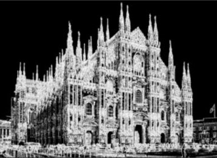
      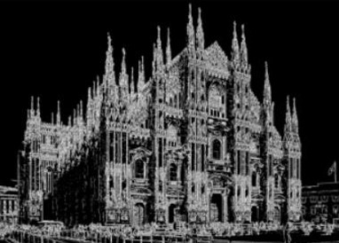
     

